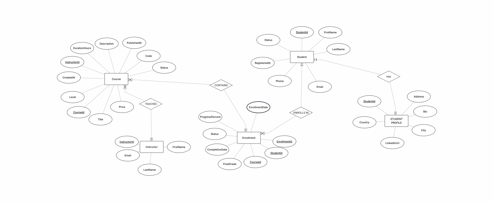
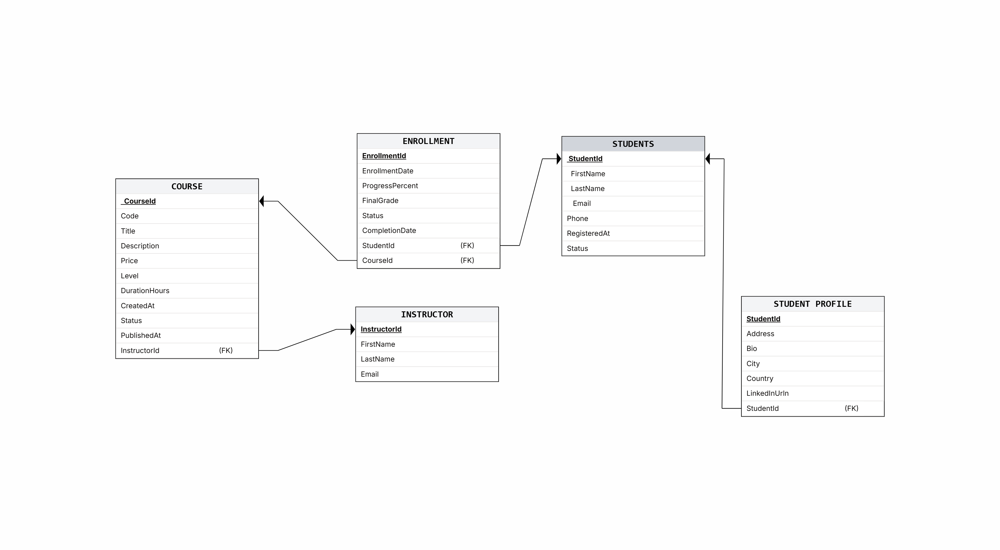

# 🎓 Training Center Management System

A console-based Training Center Management System built using:

- C#
- .NET
- Entity Framework Core
- SQL Server

The project follows a clean layered architecture and demonstrates real-world backend development concepts including:

- Entity Relationships
- CRUD Operations
- Database Design
- Navigation Properties
- Console UI Management
- Layered Architecture

---

# 🚀 Features

## 👨‍🎓 Student Management
- Add Students
- Update Students
- Delete Students
- View All Students

## 📚 Course Management
- Add Courses
- Update Courses
- Delete Courses
- View All Courses

## 📝 Enrollment System
- Register Students In Courses
- View Student Enrollments
- Prevent Duplicate Enrollments

## 👨‍🏫 Instructor Management
- Manage Instructors
- Assign Courses

## 👤 Student Profile
- One-To-One Relationship
- Student Profile Information

---

# 🏗️ Project Architecture

The project follows a clean layered architecture:

```text
Presentation Layer (UI)
        ↓
Service Layer
        ↓
Data Layer
        ↓
SQL Server Database
```

---

# 📂 Project Structure

```text
TrainingCenter.ConsoleApp
│
├── Data
│   └── AppDbContext.cs
│
├── Entities
│   ├── Student.cs
│   ├── StudentProfile.cs
│   ├── Course.cs
│   ├── Instructor.cs
│   └── Enrollment.cs
│
├── Services
│   ├── StudentService.cs
│   ├── CourseService.cs
│   └── EnrollmentService.cs
│
├── UI
│   ├── Menu.cs
│   ├── StudentMenuActions.cs
│   ├── CourseMenuActions.cs
│   ├── EnrollmentMenuActions.cs
│   └── InputHelper.cs
│
├── Images
│   ├── ERD.png
│   └── RS.png
│
├── appsettings.json
└── Program.cs
```

---

# 🗄️ Database Design

## Relationships

### One-To-Many
- Instructor → Courses
- Student → Enrollments
- Course → Enrollments

### Many-To-Many
- Students ↔ Courses  
(Via Enrollment Table)

### One-To-One
- Student ↔ StudentProfile

---

# ⚙️ Technologies Used

- C#
- .NET
- Entity Framework Core
- SQL Server
- LINQ
- Fluent API
- Console Application
- Layered Architecture

---

# 🧠 Concepts Applied

- CRUD Operations
- Entity Relationships
- Navigation Properties
- Data Validation
- Separation Of Concerns
- Clean Code Principles
- Database Normalization

---

# 📸 Database Diagrams

## ERD Diagram



---

## Relational Schema



---

# ▶️ How To Run

## 1️⃣ Clone Repository

```bash
git clone https://github.com/YOUR-USERNAME/Training-Center-Management-System.git
```

---

## 2️⃣ Open Solution

Open the project using:

- Visual Studio 2022

---

## 3️⃣ Configure Database

Update connection string inside:

```json
appsettings.json
```

---

## 4️⃣ Run Database

```powershell
Update-Database
```

---

## 5️⃣ Start Application

Run the project and use the console menu.

---

# 👨‍💻 Author

Designed & Developed By

# Shady Mahmoud

---

# 🌟 Project Goal

This project was built for:

- Backend Practice
- Entity Framework Core Practice
- SQL Server Practice
- Clean Architecture Understanding
- Real-World CRUD System Simulation

---

# ⭐ Support

If you like the project, give it a star ⭐
